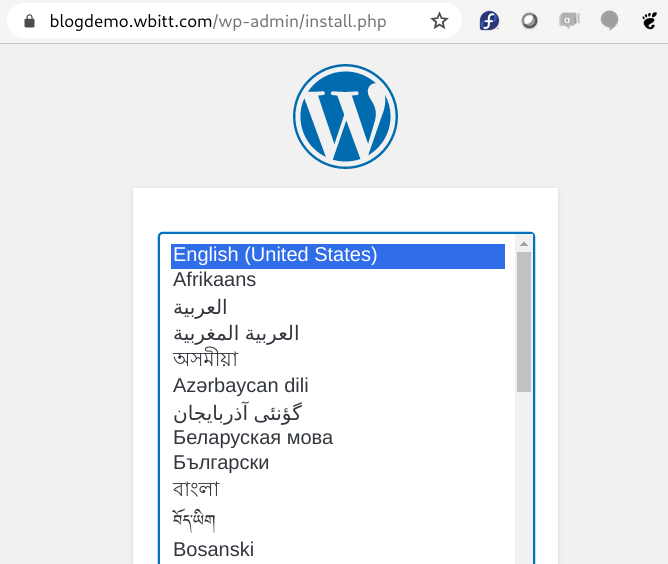
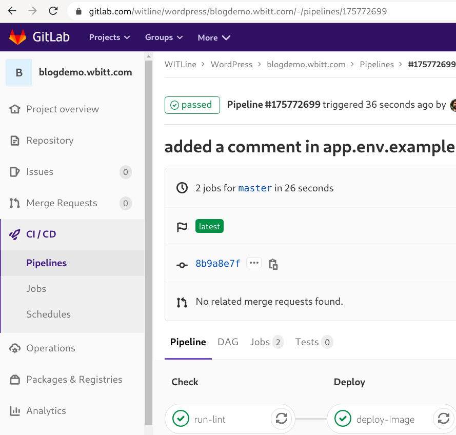
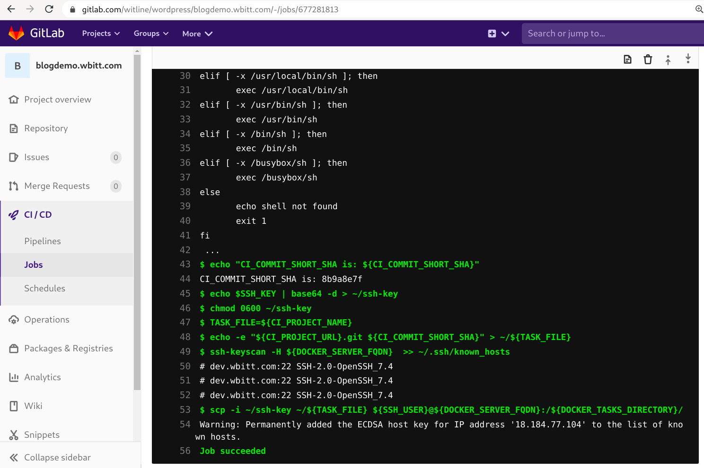
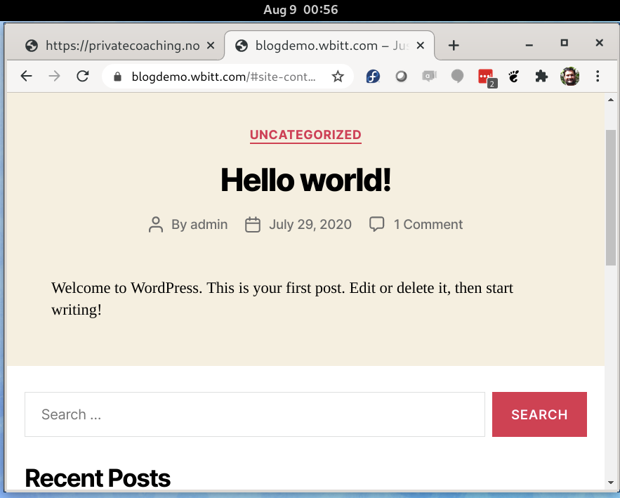

# deploy2docker - A toolset to deploy docker-compose apps to a plain docker-compose server

This is mainly a CI helper / orchestrator for docker. The idea is to mimic kubernetes in terms of major components, when you are not using Kubernetes for any reason. This tool tries to bring the **"running state"** of your docker-server to your **"desired-state"** , specified in your `docker-compose.yml` file - all using a CI pipeline - thus a **"deployer"**. 

## Why?/Inspiration:
I understand that Kubernetes is on the rise. It is the most favored platform for deploying containerized applications for last five years, and everyone is either migrating, or eager to migrate their infrastructure to Kubernetes. So where does docker-compose fit? Well, Kubernetes may be extremely popular, but entrypoint to Kubernetes is a bit hard. Also, for anyone trying to dockerize an application, or just trying a container image to see how it works, and how few containers (micro-services) would work together to solve a particular problem, **docker-compose** is the easiest tool to use. Also, many people have dockerized their applications, but they are not ready for Kubernetes yet. Some of them may have just one small server, which they use as docker host and manually run their applications - as docker-compose apps - on that server. For those people, ability to bring up all the docker-compose apps at the system boot time, and ability to use git+CI pipelines to deploy their code automatically on their docker host(s) is a huge benefit.

I was in this situation about two years ago, and it inspired me to develop this tool-set. (For those who are wondering, I **did not** want to use terraform, ansible or any configuration management system to do this. Those tools make this a very complex problem. So, **no.**) 

In late 2018, I helped a friend of mine to dockerize his applications. These applications (before dockerization) used to be deployed on Linux VMs using traditional system administration methods and tools. Some of these applications were wordpress based websites, and some were code which his team wrote in different programming languages. I helped him deploy the new dockerized applications on individual docker servers. That was when I developed some tools to help automate many aspects of the deployment. 

These tools were:
* Automatic start-up of all compose applications at system boot time, *by pulling latest changes from respective git repositories*. - **docker-compose-apps.sh**
* Automatic deployment from git using CI, without any need to manually log on to the server over ssh and restart any the docker-compose applications. - **deployer**

## Use case:
Suppose you want to deploy a docker-compose application on your docker server. The application could be a simple HTML based website, or a JavaScript application, or wordpress website, etc. You also want to be able to automatically deploy any (future) changes made in your application to be deployed to your docker server, through a CI pipeline. This is the use-case for these tools.

## Assumptions: 
This tools is opinionated and is designed for specific situations. It assumes the following:

* You are relatively small team/company, with shoe-string budget. i.e. You have one or **few** servers in your **"infrastructure"**.
* You have not migrated your applications to Kubernetes because you/your team does not have enough Kubernetes skills yet, or you cannot afford (financially) a Kubernetes cluster provided by various cloud providers.
* You have dockerized apps running on a **single** (and plain) docker host/server. *Not Docker Swarm*
* In case you have distributed multiple (dockerized) apps over multiple docker hosts/servers, each docker host is an independent docker host. There is no shared container network, nor any other clustering technology in place.
* You are running these dockerized apps using **docker-compose**.
* You are the only one managing this/these servers, and the deployment of all dockerized apps; **Or,** you may be a very small team, who are in agreement on how to handle these servers, and how to deploy apps on these servers.
* You have a **single** git repositories location (git-hub/lab/bucket/your-own/etc) for all the software you are developing. This is true for all the close-source software you / your team may be developing. You will need to create a **Git Token** (with limited read-only access to your repositories) to be used by CI system of your choice, to pull the application code from your private git repositories. You will also use this git token from the docker server to pull the git repository to the docker server. If you are deploying code from open-source repositories, then this does not apply.
* Connected to previous assumption, you are able to setup/save the same git token as "git credentials" under the home directory of user `deployer`. This means you trust the people in the team, who will have either access to this user, or people with `sudo` access. To be on the safe side, the git token has only **"read-repository"** access/permissions.
* The **master branch** of all your individual repositories **always contain code that is ready to deploy**. All other code being developed/tested/etc is in other branches.
* You are willing to keep secrets of various docker-compose apps in a central location on the docker host, such as: `/home/containers-secrets/<repository-name>/<filename>.env`, and you are OK with sharing the secrets with your (small) team, or with some people from that small team.
* All docker-compose applications will either use a publicly available image, or build their own images.
* And finally, you have SSH access to the docker server, as `root`.


## How does it work?
Well, first you prepare the docker host with the CI/CD automation tools from this repository. i.e. clone this (`deploy2docker`) repository in `/home/deploy2docker/` directory on your docker host, setup correct ownership and permissions, and setup the required `cron` job.

After that, for each application you want to deploy through CI/CD, you setup it's components in necessary directories on the docker host. For example, for any given docker-compose based application:

* the run-time code will be stored under: `/home/containers-runtime/<repository-name>/` (this is what is cloned/pulled from the related git repository) 
* the persistent data is stored under `/home/containers-data/<repository-name>/`
* the secrets would be stored as files under `/home/containers-secrets/<repository-name>/<filename>.env`
* the `docker-compose.yml` file of your application uses above locations for storing persistent data and loading secrets.

Then, test deploy the application manually. 

When everything works, you automate it's deployment by adding a `.gitlab-ci.yml` to it's project directory, using code from the  [gitlab-ci.yml.example](gitlab-ci.yml.example) file included in this repository.

Once a `docker-compose` application is deployed, the control script `deployer.sh`, which - in collaboration with `cron` - works as a control loop and watches for incoming tasks. Every time you make any change in this application's git repository, the CI system detects that change and sends a special **"task file"** to the docker system. The control script `deployer.sh` picks up this task file, and works on that task. i.e. apply any changes detected in the related git repository, and restart the related docker-compose application.

### Here is how it works - the work-flow:

```
                               [Pull changes from related git repo]-->[restart container]
                                          ^
[CI server]-->                            |
              |                      [deployer.sh] ---->-----
          [internet]                     ^                   |
               |                         |                [wait 1 minute]
             [put task-file]     [pick task file]           |
                |                    ^                 [check tasks directory]
                V                    |                      |
             [ Tasks  directory on docker server ] ---<-----     
```


Lets set this up!


## The infrastructure setup:
First, the infrastructure. For this guide, I have a "dev" server `dev.wbitt.com`, for trying out ideas. It runs docker on **"Fedora Linux"**. It has a local reverse proxy (Traefik), which handles incoming requests for containers only on that server. The docker server has a bridged docker-network called `services-network` and all docker applications are connected to it.


### DNS setup:
DNS is setup correctly. I have made sure that from the internet's perspective `blogdemo.wbitt.com` points to this docker server - as Traefik will request a SSL certificate for this blog site as soon as it is started.

```
[deployer@dev blogdemo.wbitt.com]$ dig blogdemo.wbitt.com

;; QUESTION SECTION:
;blogdemo.wbitt.com.    IN  A

;; ANSWER SECTION:
blogdemo.wbitt.com.     300 IN  CNAME aws-jumpbox.wbitt.com.
aws-jumpbox.wbitt.com.  300 IN  A     18.184.77.104

[deployer@dev blogdemo.wbitt.com]$
```


I will use the server `dev.wbitt.com` to explain the concepts and perform all the steps in this guide.


## Prepare the docker server - one time setup:

The setup of mysql database service and the reverse proxy service are beyond the scope of this guide. I have already setup:

* Traefik reverse proxy as container (like ingress controller in kubernetes)
* MySQL DB as container (as you would do in kubernetes, using either CloudSQL, etc; or your own DB container/micro-service)

### Create a `deployer` user on target docker server:
This is/will be sort of a system user, so I have created it as `uid:gid` `900:900`, which is below the number `1000`. Numbers `1000` and higher are usually assigned to general system users.

Add user, and add it to the `docker` group *only*. **No need to give it sudo/admin/wheel rights.**
```
[kamran@kworkhorse ~]$ ssh root@dev.wbitt.com

[root@dev ~]# groupadd --gid 900 deployer

[root@dev ~]# useradd --uid 900 -g deployer -G docker deployer
```

### Create the directory tree, and set correct ownership:

```
[root@dev ~]# mkdir /home/containers-runtime  \
  /home/containers-data \
  /home/containers-secrets

[root@dev ~]# chown -R deployer:deployer /home/containers-*
```

The directory structure looks like this:
```
[deployer@dev ~]$ tree -L 1 /home
/home
├── containers-data
├── containers-runtime
├── containers-secrets
├── deploy2docker
├── deployer
└── kamran
```

**Note:** Normally `/home` is the largest partition on Linux systems, so I chose the disk partition mounted as `/home` to host `containers-runtime` , `containers-data`, `containers-secrets` and the `deploy2docker` tool-set being discussed in this guide. These directories need to be owned by the user `deployer`.

```
[deployer@dev ~]$ ls -lh /home/
total 8.0K
drwxr-xr-x 5 deployer deployer   71 Aug  7 23:34 containers-data
drwxr-xr-x 9 deployer deployer  155 Aug  4 22:24 containers-runtime
drwxr-x--- 3 deployer deployer   32 Jul 31 19:11 containers-secrets
drwxr-xr-x 4 deployer deployer  214 Aug  5 00:00 deploy2docker
drwx------ 4 deployer deployer  188 Aug  5 00:00 deployer
drwx------ 3 kamran   kamran     74 Oct 20  2019 kamran
[deployer@dev ~]$ 
```

### Create git credentials/token:

Create a (github/gitlab/xyz) GIT-TOKEN to be used by this "deployer" user. This will be used to clone the (private) repositories on the docker server. Save it on your work computer, so you can refer to it later.

```
[kamran@kworkhorse gitlab]$ pwd
/home/kamran/Keys-and-Tokens/gitlab

[kamran@kworkhorse gitlab]$ ls -lh
total 4.0K
-rw-rw-r-- 1 kamran kamran 21 Jul 29 22:01 GITLAB-CI-TOKEN-used-by-dev.wbitt.com-docker-server.txt
```

On docker host, setup git credentials-helper for user "deployer". 

```
[deployer@dev ~]$ git config --global credential.helper store
```
**Note:** Because of `credential.helper store`, the first time you clone any repository, you will be asked for git user and password. Use your user and the git token as password, which will then be saved under home directory of user `deployer`.


### Create SSH key-pair for user `deployer`:
We need an dedicated SSH key-pair for this `deployer` user, which will be used by the CI system. So back on the work computer, I will create a new SSH key-pair for this purpose only.

```
[kamran@kworkhorse witline]$ pwd
/home/kamran/Keys-and-Tokens/witline
```

Note: Compared to RSA, `ed25519` is more efficient algorithm, and results in more compact keys.
```
[kamran@kworkhorse witline]$ ssh-keygen -t ed25519 -f ./deploy-from-ci-to-docker-server_ssh-key
Generating public/private rsa key pair.
Enter passphrase (empty for no passphrase): 
Enter same passphrase again: 
Your identification has been saved in ./deploy-from-ci-to-docker-server_ssh-key.
Your public key has been saved in ./deploy-from-ci-to-docker-server_ssh-key.pub.
The key fingerprint is:
SHA256:vXAEGvROP5JXhX+XN2DLrdqUFHNNns431PPoyNcVYuA kamran@kworkhorse.oslo.praqma.com
The key's randomart image is:
+---[RSA 3072]----+
|     .o .  . ...o|
|       + .. o* o+|
|      . o .E++B=+|
|         = + * .+|
|          . * o .|
|           . o   |
|                 |
+----[SHA256]-----+
```

```
[kamran@kworkhorse witline]$ ls -la
total 16
drwxrwxr-x 2 kamran kamran 4096 Jul 29 21:11 .
drwxrwxr-x 7 kamran kamran 4096 Jul 29 21:07 ..
-rw------- 1 kamran kamran  432 Jul 29 21:11 deploy-from-ci-to-docker-server_ssh-key
-rw-r--r-- 1 kamran kamran  115 Jul 29 21:11 deploy-from-ci-to-docker-server_ssh-key.pub
. . . 
[kamran@kworkhorse witline]$
```


### Copy the public part of the key to docker user on server:

```
[kamran@kworkhorse witline]$ cat deploy-from-ci-to-docker-server_ssh-key.pub 
ssh-ed25519 AAAAC3NzaC1lZDI1NTE5AAAAIIrNV+Tgz7Y16wBOdLf9Xg+baIKPMBIxCOlrXaWCumQz kamran@kworkhorse.oslo.praqma.com
[kamran@kworkhorse witline]$ 
```

Copy and paste this key to `docker@dev.wbitt.com:~/.ssh/authorized_keys`. 

```
[root@dev ~]# mkdir /home/deployer/.ssh

[root@dev ~]# echo 'ssh-ed25519 AAAAC3NzaC1lZDI1NTE5AAAAIIrNV+Tgz7Y16wBOdLf9Xg+baIKPMBIxCOlrXaWCumQz kamran@kworkhorse.oslo.praqma.com' > /home/deployer/.ssh/authorized_keys

[root@dev ~]# chown -R deployer:deployer /home/deployer/.ssh

[root@dev ~]# chmod go-w /home/deployer/.ssh/authorized_keys 

[root@dev ~]# ls -l /home/deployer/.ssh/
total 4
-rw-r--r-- 1 deployer deployer 115 Jul 29 19:21 authorized_keys
[root@dev ~]#
```

We would use the private part of this key to setup a gitlab CI/CD environment variable, later in this guide.


### Test login from work computer to the docker server:
```
[kamran@kworkhorse ~]$ ssh -i /home/kamran/Keys-and-Tokens/witline/deploy-from-ci-to-docker-server_ssh-key deployer@dev.wbitt.com

[deployer@dev ~]$ 
```

Check if you can run docker commands as user `deployer`:
```
[deployer@dev ~]$ docker ps
CONTAINER ID        IMAGE                                  COMMAND                  CREATED             STATUS              PORTS                                      NAMES
f02d338766b5        mysql:5.7                              "docker-entrypoint.s…"   56 minutes ago      Up 56 minutes       3306/tcp, 33060/tcp                        mysql_mysql.local_1
3cdc6a6b8aaa        traefik:1.7                            "/traefik"               56 minutes ago      Up 56 minutes       0.0.0.0:80->80/tcp, 0.0.0.0:443->443/tcp   00-traefik-proxy_traefik_1
[deployer@dev ~]$ 

```
Good.


At this point the server has the correct setup. Before we use CI/CD, I want to show you how would you setup a wordpress application manually. Even in CI/CD setup, (including applications being deployed on Kubernetes), you do need to setup some components of your application manually anyway. 

These components are:

* Database
* Persistent storage
* Secrets

Once the above three are set up, we bring in the fourth component, i.e. the actual code of this wordpress website from the git repository.


## Deploy the demo blog website - manually:
We have to do the following, which not only mimics Kubernetes, it is also helpful for the `deploy2docker` tool-set I am preparing to show later.

* Create the mysql database for this blog website.
* Set up a data directory for this application in `/home/containers-data/blogdemo.wbitt.com` (like setting up PV and PVC in kubernetes). (Yes, "I **DO NOT** use docker volumes.")
* Set up blog's application specific secrets in a central location `/home/containers-secrets/blogdemo.wbitt.com/app.env` (like secrets are created inside a central location - a namespace - in kubernetes)
* Set up the blog application by cloning the relevant git repository in `/home/containers-runtime/blogdemo.wbitt.com`.


### Create MySQL database for blog website:
```
[deployer@dev ~]$ docker exec -it mysql_mysql.local_1 /bin/bash

root@f02d338766b5:/# mysql -u root -p
Enter password: 

mysql> create database blogdemo_wbitt_com;
Query OK, 1 row affected (0.00 sec)

mysql> grant all on blogdemo_wbitt_com.* to 'blogdemo_wbitt_com'@'%' identified by 'blog-password';
Query OK, 0 rows affected, 1 warning (0.00 sec)

mysql> flush privileges;

```

### Setup persistent-storage directory for this blog site:
This is similar to creating a PV/PVC in kubernetes. 

Create the directory `/home/containers-data/blogdemo.wbitt.com` owned by user `deployer`. In Apache docker container, the user can be set to whatever you want the server process to run as. My docker host user is `deployer`, which has `uid` set to `900`, so I will set ownership of this directory to user `deployer` on the host. This is automatically achieved, if you create this directory as user `deployer`.

My `docker-compose.server.yml` file expects to mount `/home/containers-data/blogdemo.wbitt.com` from the host, so we create that. 

```
[deployer@dev ~]$ mkdir -p /home/containers-data/blogdemo.wbitt.com
```

### Setup secrets for this blog site:
This is similar to creating secrets in kubernetes. 

Create `blogdemo.wbitt.com` directory under `/home/containers-secrets/blogdemo.wbitt.com`, owned by user `deployer` and ensured that no-one else can go inside this directory.  

```
[deployer@dev ~]$ mkdir -p /home/containers-secrets/blogdemo.wbitt.com

[deployer@dev ~]$ chmod 750 /home/containers-secrets/blogdemo.wbitt.com

```

Then, create `app.env` - or whatever the "secrets file(s)" for your project is - under the `/home/containers-secrets/blogdemo.wbitt.com/` directory. 

```
[deployer@dev blogdemo.wbitt.com]$ cat app.env
WORDPRESS_DB_HOST=mysql.local
WORDPRESS_DB_NAME=blogdemo_wbitt_com
WORDPRESS_DB_USER=blogdemo_wbitt_com
WORDPRESS_DB_PASSWORD=blog-password
WORDPRESS_TABLE_PREFIX=wp_
APACHE_RUN_USER=#900
APACHE_RUN_GROUP=#900
[deployer@dev blogdemo.wbitt.com]$
```

### Clone the blog's git repository:

```
[deployer@dev containers-runtime]$ pwd
/home/containers-runtime


[deployer@dev containers-runtime]$ git clone https://gitlab.com/witline/wordpress/blogdemo.wbitt.com.git
Cloning into 'blogdemo.wbitt.com'...
Username for 'https://gitlab.com': kamranazeem
Password for 'https://kamranazeem@gitlab.com': 
remote: Enumerating objects: 106, done.
remote: Counting objects: 100% (106/106), done.
remote: Compressing objects: 100% (89/89), done.
remote: Total 106 (delta 47), reused 0 (delta 0), pack-reused 0
Receiving objects: 100% (106/106), 15.23 KiB | 2.54 MiB/s, done.
Resolving deltas: 100% (47/47), done.
[deployer@dev containers-runtime]$
```

```
[deployer@dev containers-runtime]$ ls -l
total 12
drwxr-xr-x 2 deployer deployer  114 Jul 16 14:11 00-traefik-proxy
drwxrwxr-x 6 deployer deployer  283 Jul 29 20:05 blogdemo.wbitt.com   <---- This one!
drwxr-xr-x 3 deployer deployer   77 Jul 29 19:57 mysql
[deployer@dev containers-runtime]$ 
```

### Examine the docker-compose file for the blog website:

```
[deployer@dev containers-runtime]$ cd blogdemo.wbitt.com

[deployer@dev blogdemo.wbitt.com]$ cat docker-compose.server.yml  
version: "3"
services:
  blogdemo.wbitt.com:
    image: wordpress:latest
    labels:
      - traefik.enable=true
      - traefik.port=80
      - traefik.frontend.rule=Host:blogdemo.wbitt.com
    env_file:
      - /home/containers-secrets/blogdemo.wbitt.com/app.env
    volumes:
      - /home/containers-data/blogdemo.wbitt.com:/var/www/html/wp-content
    networks:
      - services-network
networks:
  services-network:
    external: true
[deployer@dev blogdemo.wbitt.com]$
```

### Bring up the blog site - manually:
We are ready to deploy it using `docker-compose` command, and the `docker-compose.server.yml` file. 

**Note:** I keep two docker-compose yaml files inside the docker-compose apps I work with. One is for the "dev PC", and the other is for deploying on the "server". I **do not** keep a simple `docker-compose.yml` to avoid accidents. 

```
[deployer@dev blogdemo.wbitt.com]$ docker-compose -f docker-compose.server.yml up -d
```


```
[deployer@dev blogdemo.wbitt.com]$ docker-compose -f docker-compose.server.yml ps
                Name                               Command               State   Ports 
---------------------------------------------------------------------------------------
blogdemowbittcom_blogdemo.wbitt.com_1   /usr/local/bin/wordpress-c ...   Up      80/tcp


[deployer@dev blogdemo.wbitt.com]$ docker ps
CONTAINER ID        IMAGE                                  COMMAND                  CREATED             STATUS              PORTS                                      NAMES
a599ff22b84e        blogdemowbittcom_blogdemo.wbitt.com    "/usr/local/bin/word…"   37 seconds ago      Up 35 seconds       80/tcp                                     blogdemowbittcom_blogdemo.wbitt.com_1
f02d338766b5        mysql:5.7                              "docker-entrypoint.s…"   2 hours ago         Up 2 hours          3306/tcp, 33060/tcp                        mysql_mysql.local_1
3cdc6a6b8aaa        traefik:1.7                            "/traefik"               2 hours ago         Up 2 hours          0.0.0.0:80->80/tcp, 0.0.0.0:443->443/tcp   00-traefik-proxy_traefik_1
[deployer@dev blogdemo.wbitt.com]$ 
```

Okay! It works!

### Install wordpress:
This is application level process, and would always be done manually.

|  |
| ----------------------------------------------------------- |


|  |
| --------------------------------------------------------- |

------

## deploy2docker:
Once a `docker-compose` application is deployed, we can use a control script `deployer.sh` - which , in collaboration with `cron` - works as a control loop, and watches for incoming changes. As soon, as CI system connected to a repository sends a special **"task file"** to the docker server, the control script `deployer.sh` (on the server) picks up this task file, and works on that task. i.e. apply any changes, and restart the related docker-compose application.

### Setup `deploy2docker`:
This is set of scripts (this repository), which need to be placed in some directory on the docker host. In our case, these scripts are placed inside `/home/deploy2docker/` directory.

```
[root@dev ~]# cd /home/
[root@dev ~]# git clone https://github.com/Praqma/deploy2docker.git
[root@dev ~]# chown deployer:deployer -R /home/deploy2docker/
```


**Notes:**
* `/home/deploy2docker` is just a directory under `/home`. It does not mean that there is also a user named `deploy2docker` . This directory (`deploy2docker`) needs to be owned and readable by user `deployer` (and `root`) only.
* Normally `/home` is the largest partition on Linux systems, so I chose the disk partition mounted as `/home` to setup `deploy2docker`. If you want to set it up in some other directory (e.g. `/opt/deploy2docker/`), it is ok to do so.

### Setup cron job on the server:
We need a cron job on the docker host, for the user "deployer". It would look like this:

```
[deployer@dev ~]$ crontab -e
*/1 * * * * /home/deploy2docker/deployer.sh
```

### Configure `/home/deploy2docker/deployer.sh` script:
Configure the following variables in the script:

```
[deployer@dev ~]$ vi /home/deploy2docker/deployer.sh

# This is the main directory,
#   where all the run-time definitions of your compose apps reside -
#   - each in a separate directory:
CONTAINER_RUNTIME_DIRECTORY=/home/containers-runtime

# The name of directory in which  deploy2docker tools/scripts reside:
# e.g: DEPLOY2DOCKER_DIRECTORY=/opt/deploy2docker
DEPLOY2DOCKER_DIRECTORY=/home/deploy2docker

# This is the name of the docker-compose file, found in your applications:
DOCKER_COMPOSE_FILE=docker-compose.server.yml
```


### Setup SSH_KEY as CI/CD environment variable for `blogdemo.wbitt.com` repository:

On the work computer, convert the private SSH key into `base64`, and then save it as a variable `SSH_KEY` as CI variable in the gitlab web interface, under `Settings -> CI/CD -> Variables` .

```
[kamran@kworkhorse witline]$ cat deploy-from-ci-to-docker-server_ssh-key | base64 -w 0
```

### Monitor the log files in separate terminal:
At the moment, there is no task for `deployer.sh`, so there is no action being recorded in the log file `/home/deploy2docker/logs/deployer.log`.

```
[deployer@dev ~]$ tail -f  /home/deploy2docker/logs/deployer.log 
2020-08-08_21:46:01 Starting script /home/deploy2docker/deployer.sh
2020-08-08_21:46:01 Finished running the script /home/deploy2docker/deployer.sh
2020-08-08_21:47:01 Starting script /home/deploy2docker/deployer.sh
2020-08-08_21:47:01 Finished running the script /home/deploy2docker/deployer.sh
2020-08-08_21:48:01 Starting script /home/deploy2docker/deployer.sh
2020-08-08_21:48:01 Finished running the script /home/deploy2docker/deployer.sh
. . . 
```

There is another log file `/home/deploy2docker/logs/deployer.done.log` recording just the "done" status. At the moment, there is nothing in it.

```
[deployer@dev ~]$ tail -f  /home/deploy2docker/logs/deployer.done.log
```


## Setup CI/CD for `blogdemo.wbitt.com`:
At this point, we setup the final piece of the CI/CD mechanism for this application.

Create a `.gitlab-ci.yml` file which has a deployment stage configured to creates and pushes a *task file* to the docker server. You can use this code as reference for your setup. Make sure to maintain the three variables (values can change), and the `deploy-the-app` section of code. You don't need to change anything in `deploy-the-app` section including the image being used ([kamranazeem/ssh-server](https://gitlab.com/kamranazeem/ssh-server)).

```
[kamran@kworkhorse blogdemo.wbitt.com]$ cat .gitlab-ci.yml 
stages:
  - check
  - deploy

variables:
  DOCKER_SERVER_FQDN: dev.wbitt.com
  SSH_USER: deployer
  DOCKER_TASKS_DIRECTORY: /home/deploy2docker/deployer.tasks.d

run-lint:
  stage: check
  image: php:cli-alpine
  script:
    - find . -name '*.php' -exec php -ln '{}' ';'
  only:
    - master

deploy-the-app:
  image: kamranazeem/ssh-server
  stage: deploy
  script:
    - 'echo "CI_COMMIT_SHORT_SHA is: ${CI_COMMIT_SHORT_SHA}"'
    - echo $SSH_KEY | base64 -d > ~/ssh-key
    - chmod 0600 ~/ssh-key
    - TASK_FILE=${CI_PROJECT_NAME}
    - echo -e "${CI_PROJECT_URL}.git ${CI_COMMIT_SHORT_SHA}" > ~/${TASK_FILE}
    - ssh-keyscan -H ${DOCKER_SERVER_FQDN}  >> ~/.ssh/known_hosts
    - scp -i ~/ssh-key ~/${TASK_FILE} ${SSH_USER}@${DOCKER_SERVER_FQDN}:/${DOCKER_TASKS_DIRECTORY}/

  only:
    - master
[kamran@kworkhorse blogdemo.wbitt.com]$ 
```
**Note:** The actual [gitlab-ci.yml.example](gitlab-ci.yml.example) file - part of this `deploy2docker` repository) - is heavily commented, to help readability and understanding. Above is a simplified version.


------

## Deploy the wordpress application through CI/CD:
It is time to push the `.gitlab-ci.yml` file we created a moment ago to the repository, and let "gitlab-ci" deploy this automatically to this docker host. We will just watch the logs.

```
[kamran@kworkhorse blogdemo.wbitt.com]$ git add .gitlab-ci.yml

[kamran@kworkhorse blogdemo.wbitt.com]$ git commit -m "added a .gitlab-ci.yml file"

[kamran@kworkhorse blogdemo.wbitt.com]$ git push 
```

Check the logs:
```
[deployer@dev ~]$ tail -f  /home/deploy2docker/logs/deployer.log 

2020-08-08_22:41:01 Finished running the script /home/deploy2docker/deployer.sh
2020-08-08_22:42:01 Starting script /home/deploy2docker/deployer.sh
. . . 
2020-10-20_20:25:01 =====>  Processing deployment task file: /home/deploy2docker/deployer.tasks.d/blogdemo.wbitt.com
2020-10-20_20:25:01 Syntax is OK for GIT repository URL: 'https://gitlab.com/witline/wordpress/blogdemo.wbitt.com.git'
2020-10-20_20:25:01 Syntax is OK for GIT repository hash: '03390abe'
2020-10-20_20:25:01 Local directory '/home/containers-runtime/blogdemo.wbitt.com' does not exist - OR - is not a 'git' directory.
2020-10-20_20:25:01 Attempting to clone the repo 'https://gitlab.com/witline/wordpress/blogdemo.wbitt.com.git' into '/home/containers-runtime/blogdemo.wbitt.com' ...
2020-10-20_20:25:01 Creating directory /home/containers-runtime/blogdemo.wbitt.com ...
2020-10-20_20:25:01 Cloning repo https://gitlab.com/witline/wordpress/blogdemo.wbitt.com.git into /home/containers-runtime/blogdemo.wbitt.com ...
2020-10-20_20:25:03 Building fresh image using 'docker-compose build --force-rm' ...
2020-10-20_20:25:03 This may take a while depending on the size/design of the application.
2020-10-20_20:25:04 Starting docker-compose application - blogdemo.wbitt.com ...
2020-10-20_20:25:04 This may take a while depending on the size/design of the application.
2020-10-20_20:25:32 Application in the repo 'blogdemo.wbitt.com' has been started successfully.
2020-10-20_20:25:32 Recording 'GIT-CLONE-DOCKER-SUCCESS' in: /home/deploy2docker/logs/deployer.done.log ...
2020-10-20_20:25:32 Removing deployment task file: /home/deploy2docker/deployer.tasks.d/blogdemo.wbitt.com ...
2020-10-20_20:25:32 Finished running the script /home/deploy2docker/deployer.sh
. . . 
2020-10-20_20:26:01 Starting the script /home/deploy2docker/deployer.sh
2020-10-20_20:26:01 Finished running the script /home/deploy2docker/deployer.sh
```

Check the "done" file:
```
[deployer@dev deploy2docker]$ tail logs/deployer.done.log 
2020-10-19_10:13:06 	 https://gitlab.com/kamranazeem/basicweb.wbitt.com.git 	 b4551529 	 GIT-CLONE-DOCKER-SUCCESS
2020-10-20_18:47:19 	 https://gitlab.com/kamranazeem/basicweb.wbitt.com.git 	 e2faa17d 	 GIT-PULL-DOCKER-SUCCESS
2020-10-20_18:48:09 	 https://gitlab.com/kamranazeem/basicweb.wbitt.com.git 	 3d2a4ccd 	 GIT-PULL-DOCKER-SUCCESS
2020-10-20_20:01:08 	 https://gitlab.com/kamranazeem/basicweb.wbitt.com.git 	 83dcda7f 	 GIT-PULL-DOCKER-SUCCESS
2020-10-20_20:25:32 	 https://gitlab.com/witline/wordpress/blogdemo.wbitt.com.git 	 03390abe 	 GIT-CLONE-DOCKER-SUCCESS
[deployer@dev deploy2docker]$ 
```

Here are the screenshots from the GitLab-CI interface:

|  |
| ------------------------------------------------- |

|  |
| ------------------------------------------------- |


The blog website works as expected:

|  |
| --------------------------------------------------------------------- |


So, we have verified that the `deployer.sh` works, and does it's thing!

------

## Other scripts which are part of `deploy2docker`:

### The systemd service:
The "deploy2docker" set of scripts/tools also has a `systemd` service-file named `docker-compose-apps.service`, which is responsible for bringing up all the docker-compose applications on a docker host, at system boot time. 

This file is fairly basic in nature, and looks like this:

```
[deployer@dev deploy2docker]$ cat docker-compose-apps.service 
[Unit]
Description=Start/stop all docker-compose applications found under /home/containers-runtime/
After=docker.service

[Service]
Type=simple
User=deployer
Group=deployer

ExecStartPre=/usr/bin/find  /home/containers-runtime/  -type d -name .git  -execdir git pull ';'

ExecStart=/home/deploy2docker/docker-compose-apps.sh start

[Install]
WantedBy=multi-user.target

[deployer@dev deploy2docker]$ 
```

**Note:** This systemd (service) file needs to be placed under `/etc/systemd/system/` .

Perform the following steps as `root` on the docker host.

```
[root@dev ~]# cp /home/deploy2docker/docker-compose-apps.service /etc/systemd/system/

[root@dev ~]# systemctl daemon-reload

[root@dev ~]# systemctl enable docker-compose-apps.service
Created symlink from /etc/systemd/system/multi-user.target.wants/docker-compose-apps.service to /etc/systemd/system/docker-compose-apps.service.
[root@dev ~]# 
```

The above steps will configure this docker host to start all docker-compose applications at system start time. 

Naturally, the above-mentioned systemd file expects that there is yet another script `docker-compose-apps.sh`, so lets look at it next.


## The starter script:
The script, which handles all docker-compose applications in one go, is `docker-compose-apps.sh` . It has three modes: `start | stop | status` .

The script has three variables, which you need to configure.

```
[deployer@dev deploy2docker]$ vi /home/deploy2docker/docker-compose-apps.sh

# This is the main directory where all the run-time definitions of your compose apps reside -
#   - each in a separate directory:
CONTAINERS_RUNTIME_DIRECTORY=/home/containers-runtime

# The name of directory in which  deploy2docker tools/scripts reside:
DEPLOY2DOCKER_DIRECTORY=/home/deploy2docker

# This is the name of the docker-compose file in your applications:
DOCKER_COMPOSE_FILE_NAME=docker-compose.server.yml
```


Lets run this script with `status` command/parameter.

```
[deployer@dev deploy2docker]$ pwd
/home/deploy2docker


[deployer@dev deploy2docker]$ ./docker-compose-apps.sh status
2020-08-09_00:43:39 Starting the script ./docker-compose-apps.sh for the 'status' operation ...

2020-08-09_00:43:39 Showing status of docker-compose application stack inside /home/containers-runtime/00-traefik-proxy ...
           Name              Command    State                    Ports                  
----------------------------------------------------------------------------------------
00-traefik-proxy_traefik_1   /traefik   Up      0.0.0.0:443->443/tcp, 0.0.0.0:80->80/tcp

2020-08-09_00:43:40 Showing status of docker-compose application stack inside /home/containers-runtime/blogdemo.wbitt.com ...
                Name                               Command               State   Ports 
---------------------------------------------------------------------------------------
blogdemowbittcom_blogdemo.wbitt.com_1   /usr/local/bin/wordpress-c ...   Up      80/tcp

2020-08-09_00:43:41 Showing status of docker-compose application stack inside /home/containers-runtime/example-wordpress-website ...
ERROR: Couldn't find env file: /home/containers-runtime/example-wordpress-website/app.env

2020-08-09_00:43:41 Showing status of docker-compose application stack inside /home/containers-runtime/mysql ...
       Name                     Command             State          Ports       
-------------------------------------------------------------------------------
mysql_mysql.local_1   docker-entrypoint.sh mysqld   Up      3306/tcp, 33060/tcp

2020-08-09_00:43:43 Finished running the script ./docker-compose-apps.sh .

[deployer@dev deploy2docker]$ 
```

The logs from the above *starter* script go into the file `/home/deploy2docker/logs/docker-compose-apps.log` . This log file is a good place to check if your docker-compose applications started at system boot time or not.

```
[deployer@dev containers-runtime]$ tail -f /home/deploy2docker/logs/docker-compose-apps.log
2020-08-09_01:18:34 Starting the script /home/deploy2docker/docker-compose-apps.sh for the 'status' operation ...
2020-08-09_01:18:35 Showing status of docker-compose application stack inside /home/containers-runtime/00-traefik-proxy ...
2020-08-09_01:18:35 'docker-compose status' is 'SUCCESS' on '/home/containers-runtime/00-traefik-proxy'.
2020-08-09_01:18:35 Showing status of docker-compose application stack inside /home/containers-runtime/blogdemo.wbitt.com ...
2020-08-09_01:18:36 'docker-compose status' is 'SUCCESS' on '/home/containers-runtime/blogdemo.wbitt.com'.
2020-08-09_01:18:36 Showing status of docker-compose application stack inside /home/containers-runtime/example-wordpress-website ...
2020-08-09_01:18:36 'docker-compose status' is 'ERROR' on '/home/containers-runtime/example-wordpress-website'.
2020-08-09_01:18:36 Showing status of docker-compose application stack inside /home/containers-runtime/mysql ...
2020-08-09_01:18:37 'docker-compose status' is 'SUCCESS' on '/home/containers-runtime/mysql'.

2020-08-09_01:18:38 Finished running the script /home/deploy2docker/docker-compose-apps.sh .
```


Lets stop all docker-compose applications on this server:

```
[deployer@dev ~]$ /home/deploy2docker/docker-compose-apps.sh stop
2020-08-09_01:19:19 Starting the script /home/deploy2docker/docker-compose-apps.sh for the 'stop' operation ...

2020-08-09_01:19:19 Stopping docker-compose application stack inside /home/containers-runtime/00-traefik-proxy ...
Stopping 00-traefik-proxy_traefik_1 ... done
2020-08-09_01:19:20 'docker-compose stop' is 'SUCCESS' on '/home/containers-runtime/00-traefik-proxy'.
2020-08-09_01:19:20 Removing 'stopped' containers ...
Going to remove 00-traefik-proxy_traefik_1
Removing 00-traefik-proxy_traefik_1 ... done
2020-08-09_01:19:21 'docker-compose rm' is 'SUCCESS' on '/home/containers-runtime/00-traefik-proxy'.

2020-08-09_01:19:21 Stopping docker-compose application stack inside /home/containers-runtime/blogdemo.wbitt.com ...
Stopping blogdemowbittcom_blogdemo.wbitt.com_1 ... done
2020-08-09_01:19:23 'docker-compose stop' is 'SUCCESS' on '/home/containers-runtime/blogdemo.wbitt.com'.
2020-08-09_01:19:23 Removing 'stopped' containers ...
Going to remove blogdemowbittcom_blogdemo.wbitt.com_1
Removing blogdemowbittcom_blogdemo.wbitt.com_1 ... done
2020-08-09_01:19:24 'docker-compose rm' is 'SUCCESS' on '/home/containers-runtime/blogdemo.wbitt.com'.

2020-08-09_01:19:24 Stopping docker-compose application stack inside /home/containers-runtime/example-wordpress-website ...
ERROR: Couldn't find env file: /home/containers-runtime/example-wordpress-website/app.env
2020-08-09_01:19:24 'docker-compose stop' is 'ERROR' on '/home/containers-runtime/example-wordpress-website'.
2020-08-09_01:19:24 Removing 'stopped' containers ...
ERROR: Couldn't find env file: /home/containers-runtime/example-wordpress-website/app.env
2020-08-09_01:19:25 'docker-compose rm' is 'ERROR' on '/home/containers-runtime/example-wordpress-website'.

2020-08-09_01:19:25 Stopping docker-compose application stack inside /home/containers-runtime/mysql ...
Stopping mysql_mysql.local_1 ... done
2020-08-09_01:19:28 'docker-compose stop' is 'SUCCESS' on '/home/containers-runtime/mysql'.
2020-08-09_01:19:28 Removing 'stopped' containers ...
Going to remove mysql_mysql.local_1
Removing mysql_mysql.local_1 ... done
2020-08-09_01:19:29 'docker-compose rm' is 'SUCCESS' on '/home/containers-runtime/mysql'.

2020-08-09_01:19:32 Finished running the script /home/deploy2docker/docker-compose-apps.sh .

[deployer@dev example-wordpress-website]$ 
```


The log file shows the following information:
```
[deployer@dev containers-runtime]$ tail -f /home/deploy2docker/logs/docker-compose-apps.log
. . . 
2020-08-09_01:19:19 Starting the script /home/deploy2docker/docker-compose-apps.sh for the 'stop' operation ...
2020-08-09_01:19:19 Stopping docker-compose application stack inside /home/containers-runtime/00-traefik-proxy ...
2020-08-09_01:19:20 'docker-compose stop' is 'SUCCESS' on '/home/containers-runtime/00-traefik-proxy'.
2020-08-09_01:19:20 Removing 'stopped' containers ...
2020-08-09_01:19:21 'docker-compose rm' is 'SUCCESS' on '/home/containers-runtime/00-traefik-proxy'.
2020-08-09_01:19:21 Stopping docker-compose application stack inside /home/containers-runtime/blogdemo.wbitt.com ...
2020-08-09_01:19:23 'docker-compose stop' is 'SUCCESS' on '/home/containers-runtime/blogdemo.wbitt.com'.
2020-08-09_01:19:23 Removing 'stopped' containers ...
2020-08-09_01:19:24 'docker-compose rm' is 'SUCCESS' on '/home/containers-runtime/blogdemo.wbitt.com'.
2020-08-09_01:19:24 Stopping docker-compose application stack inside /home/containers-runtime/example-wordpress-website ...
2020-08-09_01:19:24 'docker-compose stop' is 'ERROR' on '/home/containers-runtime/example-wordpress-website'.
2020-08-09_01:19:24 Removing 'stopped' containers ...
2020-08-09_01:19:25 'docker-compose rm' is 'ERROR' on '/home/containers-runtime/example-wordpress-website'.
2020-08-09_01:19:25 Stopping docker-compose application stack inside /home/containers-runtime/mysql ...
2020-08-09_01:19:28 'docker-compose stop' is 'SUCCESS' on '/home/containers-runtime/mysql'.
2020-08-09_01:19:28 Removing 'stopped' containers ...
2020-08-09_01:19:29 'docker-compose rm' is 'SUCCESS' on '/home/containers-runtime/mysql'.

2020-08-09_01:19:32 Finished running the script /home/deploy2docker/docker-compose-apps.sh .
. . . 
```


Verify with `docker ps` that nothing is running:
```
[deployer@dev ~]$ docker ps
CONTAINER ID        IMAGE               COMMAND             CREATED             STATUS              PORTS               NAMES
[deployer@dev ~]$ 
```


Lets start all docker-compose applications on this docker host:

```
[deployer@dev ~]$ /home/deploy2docker/docker-compose-apps.sh start
2020-08-09_01:23:39 Starting the script /home/deploy2docker/docker-compose-apps.sh for the 'start' operation ...

2020-08-09_01:23:39 Pulling latest changes from git repository linked to /home/containers-runtime/00-traefik-proxy ...

fatal: not a git repository (or any of the parent directories): .git
2020-08-09_01:23:39 'git pull' is 'SUCCESS' on '/home/containers-runtime/00-traefik-proxy'.
2020-08-09_01:23:39 Removing any existing - but 'stopped' containers ...
No stopped containers
2020-08-09_01:23:40 'docker-compose rm' is 'SUCCESS' on '/home/containers-runtime/00-traefik-proxy'.
2020-08-09_01:23:40 Re-building container images ... (This may take some time) ...
traefik uses an image, skipping
2020-08-09_01:23:40 'docker-compose build' is 'SUCCESS' on '/home/containers-runtime/00-traefik-proxy'.
2020-08-09_01:23:40 Bringing up docker-compose application stack ...
Creating 00-traefik-proxy_traefik_1 ... done
2020-08-09_01:23:42 'docker-compose up' is 'SUCCESS' on '/home/containers-runtime/00-traefik-proxy'.

2020-08-09_01:23:42 Pulling latest changes from git repository linked to /home/containers-runtime/blogdemo.wbitt.com ...

Already up to date.
2020-08-09_01:23:43 'git pull' is 'SUCCESS' on '/home/containers-runtime/blogdemo.wbitt.com'.
2020-08-09_01:23:43 Removing any existing - but 'stopped' containers ...
No stopped containers
2020-08-09_01:23:44 'docker-compose rm' is 'SUCCESS' on '/home/containers-runtime/blogdemo.wbitt.com'.
2020-08-09_01:23:44 Re-building container images ... (This may take some time) ...
Building blogdemo.wbitt.com
Step 1/3 : FROM witline/wordpress:5.4.2-php-7.4-apache-2.4
 ---> 399887d2b75a
Step 2/3 : COPY themes /usr/src/themes/
 ---> bf3dcac60ea6
Step 3/3 : COPY plugins /usr/src/plugins/
 ---> 423ea9ba6170
Successfully built 423ea9ba6170
Successfully tagged blogdemowbittcom_blogdemo.wbitt.com:latest
2020-08-09_01:23:45 'docker-compose build' is 'SUCCESS' on '/home/containers-runtime/blogdemo.wbitt.com'.
2020-08-09_01:23:45 Bringing up docker-compose application stack ...
Creating blogdemowbittcom_blogdemo.wbitt.com_1 ... done
2020-08-09_01:23:47 'docker-compose up' is 'SUCCESS' on '/home/containers-runtime/blogdemo.wbitt.com'.

2020-08-09_01:23:47 Pulling latest changes from git repository linked to /home/containers-runtime/example-wordpress-website ...

Already up to date.
2020-08-09_01:23:48 'git pull' is 'SUCCESS' on '/home/containers-runtime/example-wordpress-website'.
2020-08-09_01:23:48 Removing any existing - but 'stopped' containers ...
ERROR: Couldn't find env file: /home/containers-runtime/example-wordpress-website/app.env
2020-08-09_01:23:48 'docker-compose rm' is 'ERROR' on '/home/containers-runtime/example-wordpress-website'.
2020-08-09_01:23:48 Re-building container images ... (This may take some time) ...
ERROR: Couldn't find env file: /home/containers-runtime/example-wordpress-website/app.env
2020-08-09_01:23:49 'docker-compose build' is 'ERROR' on '/home/containers-runtime/example-wordpress-website'.
2020-08-09_01:23:49 Bringing up docker-compose application stack ...
ERROR: Couldn't find env file: /home/containers-runtime/example-wordpress-website/app.env
2020-08-09_01:23:50 'docker-compose up' is 'ERROR' on '/home/containers-runtime/example-wordpress-website'.

2020-08-09_01:23:50 Pulling latest changes from git repository linked to /home/containers-runtime/mysql ...

fatal: not a git repository (or any of the parent directories): .git
2020-08-09_01:23:50 'git pull' is 'ERROR' on '/home/containers-runtime/mysql'.
2020-08-09_01:23:50 Removing any existing - but 'stopped' containers ...
No stopped containers
2020-08-09_01:23:51 'docker-compose rm' is 'SUCCESS' on '/home/containers-runtime/mysql'.
2020-08-09_01:23:51 Re-building container images ... (This may take some time) ...
mysql.local uses an image, skipping
2020-08-09_01:23:51 'docker-compose build' is 'SUCCESS' on '/home/containers-runtime/mysql'.
2020-08-09_01:23:51 Bringing up docker-compose application stack ...
Creating mysql_mysql.local_1 ... done
2020-08-09_01:23:53 'docker-compose up' is 'SUCCESS' on '/home/containers-runtime/mysql'.

2020-08-09_01:23:59 Finished running the script /home/deploy2docker/docker-compose-apps.sh .

[deployer@dev ~]$ 
```


Lets look at the log file also:
```
2020-08-09_01:23:39 Starting the script /home/deploy2docker/docker-compose-apps.sh for the 'start' operation ...
2020-08-09_01:23:39 Pulling latest changes from git repository linked to /home/containers-runtime/00-traefik-proxy ...
2020-08-09_01:23:39 'git pull' is 'SUCCESS' on '/home/containers-runtime/00-traefik-proxy'.
2020-08-09_01:23:39 Removing any existing - but 'stopped' containers ...
2020-08-09_01:23:40 'docker-compose rm' is 'SUCCESS' on '/home/containers-runtime/00-traefik-proxy'.
2020-08-09_01:23:40 Re-building container images ... (This may take some time) ...
2020-08-09_01:23:40 'docker-compose build' is 'SUCCESS' on '/home/containers-runtime/00-traefik-proxy'.
2020-08-09_01:23:40 Bringing up docker-compose application stack ...
2020-08-09_01:23:42 'docker-compose up' is 'SUCCESS' on '/home/containers-runtime/00-traefik-proxy'.
2020-08-09_01:23:42 Pulling latest changes from git repository linked to /home/containers-runtime/blogdemo.wbitt.com ...
2020-08-09_01:23:43 'git pull' is 'SUCCESS' on '/home/containers-runtime/blogdemo.wbitt.com'.
2020-08-09_01:23:43 Removing any existing - but 'stopped' containers ...
2020-08-09_01:23:44 'docker-compose rm' is 'SUCCESS' on '/home/containers-runtime/blogdemo.wbitt.com'.
2020-08-09_01:23:44 Re-building container images ... (This may take some time) ...
2020-08-09_01:23:45 'docker-compose build' is 'SUCCESS' on '/home/containers-runtime/blogdemo.wbitt.com'.
2020-08-09_01:23:45 Bringing up docker-compose application stack ...
2020-08-09_01:23:47 'docker-compose up' is 'SUCCESS' on '/home/containers-runtime/blogdemo.wbitt.com'.
2020-08-09_01:23:47 Pulling latest changes from git repository linked to /home/containers-runtime/example-wordpress-website ...
2020-08-09_01:23:48 'git pull' is 'SUCCESS' on '/home/containers-runtime/example-wordpress-website'.
2020-08-09_01:23:48 Removing any existing - but 'stopped' containers ...
2020-08-09_01:23:48 'docker-compose rm' is 'ERROR' on '/home/containers-runtime/example-wordpress-website'.
2020-08-09_01:23:48 Re-building container images ... (This may take some time) ...
2020-08-09_01:23:49 'docker-compose build' is 'ERROR' on '/home/containers-runtime/example-wordpress-website'.
2020-08-09_01:23:49 Bringing up docker-compose application stack ...
2020-08-09_01:23:50 'docker-compose up' is 'ERROR' on '/home/containers-runtime/example-wordpress-website'.
2020-08-09_01:23:50 Pulling latest changes from git repository linked to /home/containers-runtime/mysql ...
2020-08-09_01:23:50 'git pull' is 'ERROR' on '/home/containers-runtime/mysql'.
2020-08-09_01:23:50 Removing any existing - but 'stopped' containers ...
2020-08-09_01:23:51 'docker-compose rm' is 'SUCCESS' on '/home/containers-runtime/mysql'.
2020-08-09_01:23:51 Re-building container images ... (This may take some time) ...
2020-08-09_01:23:51 'docker-compose build' is 'SUCCESS' on '/home/containers-runtime/mysql'.
2020-08-09_01:23:51 Bringing up docker-compose application stack ...
2020-08-09_01:23:53 'docker-compose up' is 'SUCCESS' on '/home/containers-runtime/mysql'.
2020-08-09_01:23:53 Pulling latest changes from git repository linked to /home/containers-runtime/privatecoaching.no ...
2020-08-09_01:23:53 'git pull' is 'ERROR' on '/home/containers-runtime/privatecoaching.no'.
2020-08-09_01:23:53 Removing any existing - but 'stopped' containers ...
2020-08-09_01:23:54 'docker-compose rm' is 'SUCCESS' on '/home/containers-runtime/privatecoaching.no'.
2020-08-09_01:23:54 Re-building container images ... (This may take some time) ...
2020-08-09_01:23:56 'docker-compose build' is 'SUCCESS' on '/home/containers-runtime/privatecoaching.no'.
2020-08-09_01:23:56 Bringing up docker-compose application stack ...
2020-08-09_01:23:59 'docker-compose up' is 'SUCCESS' on '/home/containers-runtime/privatecoaching.no'.
2020-08-09_01:23:59 Finished running the script /home/deploy2docker/docker-compose-apps.sh .

```

Verify with `docker ps`:

```
[deployer@dev ~]$ docker ps
CONTAINER ID        IMAGE                                  COMMAND                  CREATED              STATUS              PORTS                                      NAMES
ca55aaca0618        privatecoachingno_privatecoaching.no   "/usr/local/bin/word…"   About a minute ago   Up About a minute   80/tcp                                     privatecoachingno_privatecoaching.no_1
06de238ea418        mysql:5.7                              "docker-entrypoint.s…"   About a minute ago   Up About a minute   3306/tcp, 33060/tcp                        mysql_mysql.local_1
df2bcde3fb87        blogdemowbittcom_blogdemo.wbitt.com    "/usr/local/bin/word…"   About a minute ago   Up About a minute   80/tcp                                     blogdemowbittcom_blogdemo.wbitt.com_1
83fd394de097        traefik:1.7                            "/traefik"               About a minute ago   Up About a minute   0.0.0.0:80->80/tcp, 0.0.0.0:443->443/tcp   00-traefik-proxy_traefik_1
[deployer@dev ~]$ 
```

Everything is up! Very good.

**Notes:**
In the logs, you see:
* a directory `/home/containers-runtime/example-wordpress-website` is failing, because I placed it in as something which should fail. (It's `app.env` file is missing - on purpose). Seeing it fail proves that the script is doing it's thing.
* **mysql** is setup to run as docker-compose application , but it's setup does not come from a git repository. That is why you see `ERROR` during `git pull` when the script is processing the  mysql directory. This is ok in my setup. 


# Conclusion:
`deploy2docker` is a set of tools, which makes your life very easy; especially, when - for whatever reason - kubernetes is not an option, you are forced to manage docker-compose applications on docker host, and you don't want to be the meatware-CI (human-CI) for yourself, or your development team. 

I hope you enjoy using these tools as much as I enjoyed developing them, and using them! I have complete peace of mind since I deployed these two tools on my docker servers. I believe they can be used safely by others in similar situations.

